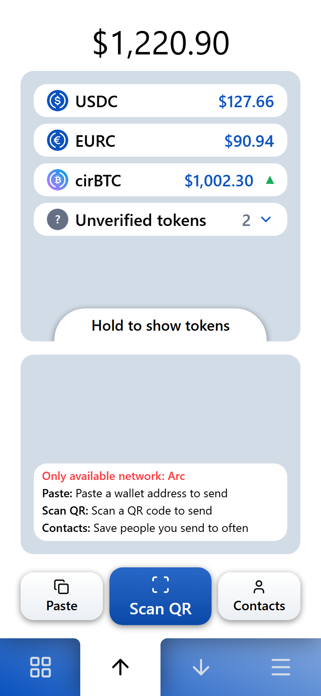
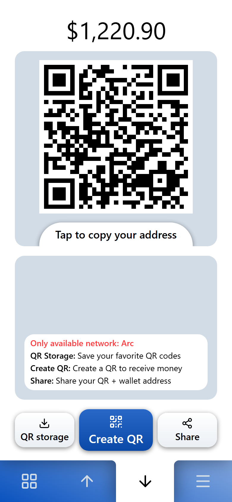
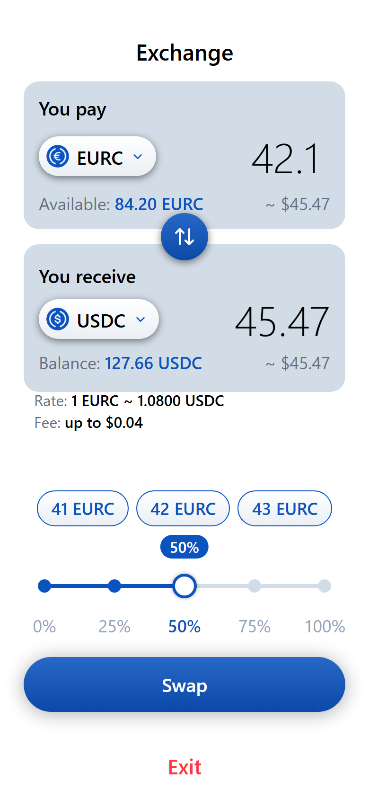
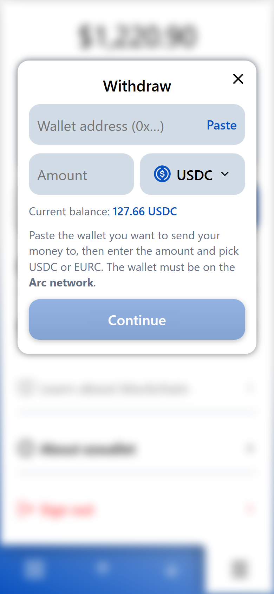

<div align="center">

# ezwallet

**A crypto wallet simple enough for my mom to use.**

[](https://ezwallet.cash)
[](https://explorer.arc.io)
[](https://docs.google.com/presentation/d/1-MuqJeSV1Riwg3Bx6IXZSuNumqbtM83dmzG48-vIRDQ/edit?usp=sharing)
[](./LICENSE)

</div>

> **Live on Arc Mainnet** at **[ezwallet.cash](https://ezwallet.cash)** – real USDC, EURC and cirBTC.

---

## Screens

<div align="center">
<table>
<tr>
<td align="center" width="25%"><br><sub>Balance & send</sub></td>
<td align="center" width="25%"><br><sub>Receive by QR</sub></td>
<td align="center" width="25%"><br><sub>Exchange</sub></td>
<td align="center" width="25%"><br><sub>Deposit & withdraw</sub></td>
</tr>
</table>
</div>

---

## Core belief

> ezwallet was built on a simple belief: everyone should be able to own their
> own money, without needing to become a crypto expert.
>
> Self-custody shouldn't mean memorizing seed phrases, copying long wallet
> addresses, or worrying about gas tokens. Those are technical barriers, not
> the value of crypto.
>
> We believe people shouldn't have to adapt to crypto. Crypto should adapt to
> people, making it simple enough for anyone to use while preserving full
> ownership of their money.

Every product decision in this repo traces back to this belief.

## The problem

Most crypto wallets are built for people who already understand crypto. Seed
phrases, gas tokens, hex addresses, network switching – every one of those is a
wall for a first-time user, and an outright dealbreaker for someone older who
just wants to send money to their family.

## The approach

ezwallet removes the crypto vocabulary from the surface:

- **No seed phrase.** Sign in with an email and a PIN.
- **No separate gas token.** Arc uses USDC as its native gas currency, so a user
  never has to buy a second coin just to move the first one.
- **Big type, few choices per screen.** Every screen is laid out on a fixed
  10-row grid with large text and one primary action, aimed at users with
  weaker eyesight and low tolerance for clutter.

## Features

| | |
|---|---|
| 🔑 **Email + PIN login** | No seed phrase to write down or lose. Keys are held in Circle's MPC infrastructure; the PIN authorises every signature. |
| 💸 **Send with a note** | Attach a short message to a transfer, so the receiver knows what the money is for. The network fee is shown up front ("up to", Circle's own estimate). |
| 🔄 **Auto-convert on send** | Sending dollars but short of USDC? The missing part is swapped from your EURC (then cirBTC) inside the same transaction – still one PIN. |
| ⇅ **Deposit & withdraw** | Menu → Deposit shows your Arc address to top up from an exchange or another wallet; Withdraw sends to any Arc address. |
| 📷 **Receive by QR** | Show a QR to get paid. Standard EVM format (EIP-681, with Arc's chain ID), so other wallets such as MetaMask can scan it. Optionally set an exact amount, name it, and keep it in a QR library for reuse. |
| ⇄ **Exchange** | Swap between USDC, EURC and cirBTC. What you receive is never more than 0.5% below the amount shown (the minimum is enforced on chain, otherwise nothing is swapped); the network fee shown is Circle's estimate for that exact swap. No app fee. |
| ❔ **Unverified tokens** | Tokens the app does not list (airdrops, meme coins) are shown separately with a yellow notice when one arrives – never counted in your balance. They can be sent on (clearly marked), but not swapped. |
| 👥 **Contacts** | Save addresses under a name (with an avatar) so you never paste a raw `0x…` twice. |
| 🧾 **History + receipts** | Full transaction history with per-transaction detail and a saveable receipt image. |
| 🌐 **USD or EUR display** | Show balances in US dollars or euros. The underlying token (USDC or EURC) is always labelled honestly. |
| 📣 **Notices from the team** | Short announcements (never with a link) appear in the app's notification area. |
| 📄 **Terms, privacy, support** | Terms of Use and Privacy Policy are inside the app (Menu → About); support at **support@ezwallet.cash**. |

**In testing** (only on [test.ezwallet.cash](https://test.ezwallet.cash), same mainnet, real money): a **Service hub**
with *Lending* (earn interest on USDC/EURC in curated Morpho vaults), *Borrow* (USDC against cirBTC, kept at ≤ 50% LTV,
with liquidation alerts by email) and *Memes* (buy/sell tokens launched on Argus, honeypot-checked by simulation first).
They reach ezwallet.cash only after real-money tests pass.

## Tech stack

| Layer | What it uses |
|---|---|
| **Wallet** | [Circle User-Controlled Wallets](https://developers.circle.com/w3s/programmable-wallets) – MPC key management, PIN-based signing (`@circle-fin/w3s-pw-web-sdk`) |
| **Chain** | [Arc](https://docs.arc.io) L1 mainnet (`chainId 5042`); **USDC is the native gas token** |
| **Frontend** | React 18 + Vite 5, `viem` for on-chain reads, `qrcode.react` / `jsqr` for QR |
| **Backend** | Cloudflare Pages + Pages Functions (`functions/api/*`) – keeps the Circle API key server-side; KV for sign-in codes and the contacts backup |
| **Swap / earn / borrow** | Circle Stablecoin Kits (quote + one-PIN batch through Multicall3), every batch simulated with `eth_simulateV1` before the PIN |
| **Prices** | CoinGecko (cross-checked with Binance), cached 5 minutes – no price, no number (`…`) |

Tokens: **USDC**, **EURC** and **cirBTC**. Transfer notes are written on-chain through Arc's
predeployed Memo contract.

## Try it

1. Open **[ezwallet.cash](https://ezwallet.cash)**.
2. Create a wallet with your **email** – you'll receive a one-time code, then set
   a 6-digit PIN.
3. Add money: **Menu → Deposit** shows your wallet address. Send USDC (or EURC) to it
   **on the Arc network** from an exchange or another wallet.
4. Send some to a friend, or have them show you their QR.

> ⚠️ This is **Arc Mainnet** – real money. Start with a small amount.

## Local setup

**Requirements:** Node.js 18+ (developed on Node 22), a
[Circle console](https://console.circle.com) account for API keys.

```bash
git clone https://github.com/KattyFury/project_arc_ezwallet.git
cd project_arc_ezwallet
npm install
```

Create your env file and fill in the keys:

```bash
cp .env.example .env.txt      # .env.txt is gitignored
```

| Variable | Needed for |
|---|---|
| `API_KEY` | Circle LIVE API key: User-Controlled Wallets (login, PIN, send) and swap (Stablecoin Kit). `CIRCLE_API_KEY` also accepted. |
| `AUTH_SECRET` | Signs the email-code sign-in tokens (any long random string). |
| `RESEND_API_KEY` | Sends the 6-digit sign-in code and security emails ([Resend](https://resend.com)). |
| `COINGECKO_API` | CoinGecko Demo key for `/api/prices` (EURC / cirBTC prices; Binance public data is the backup). |

Sign-in codes and the contact backup also need a Cloudflare KV namespace bound as `EZ_SYNC`.

Then run the two processes in **separate terminals**:

```bash
npm run api     # Circle API proxy on http://localhost:8787
npm run dev     # Vite dev server on http://localhost:5173
```

Vite proxies `/api/*` to the local proxy, which mirrors what Cloudflare Pages
Functions do in production.

> ⚠️ **The Circle Web SDK does not run on `localhost`.** Login and PIN entry
> can only be exercised on a deployed build. For local UI work use mock
> mode instead.

**Mock mode** – full UI with a fake wallet and fake balances, no Circle account
required:

```bash
npm run mock    # skips login/PIN, stubs the API and chain reads
```

Other scripts:

```bash
npm run build   # production build
npm test        # unit tests (node:test)
```

## Current limitations

Being upfront about what this is not:

- **Not a bank.** ezwallet is a free, non-profit wallet app. Money is held in your own
  on-chain wallet; nobody insures it and nobody can reverse a transfer.
- **Not independently audited.** See [SECURITY.md](./SECURITY.md) for the custody model,
  the known limitations, and how to report a vulnerability privately.
- **You cannot export your private key yet.** The wallet is a Circle user-controlled
  (MPC) wallet opened with your email + PIN; there is no seed phrase or key export.
- **Arc only.** Send and receive on the Arc network. Money someone sends to your address on
  another chain does not arrive in ezwallet. The receive QR carries Arc's chain ID, but some
  wallets ignore it – the sender must still pick Arc.
- **No card or bank purchases.** There is no fiat on/off-ramp: money comes in from an
  exchange or another wallet on Arc, and goes out the same way.
- **English only**, email + PIN sign-in only (no Google sign-in).
- **QR scanning is limited to wallet QR codes** (not bank QRs or product barcodes).

## How this was built

ezwallet was built end to end in collaboration with AI – mostly Claude – by
someone with no professional programming background. The product decisions, the
UX rules and the design direction are human; the implementation was written
through conversation, then verified by actually running the flows and reading
the results.

If you're in the same boat: it's doable. Be specific about what you want, insist
on seeing it actually work, and don't accept "it should work" as an answer.

## License

[MIT](./LICENSE)
